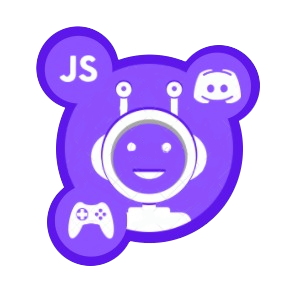

# Botcoin Bot Official  <span></span>

<p align="center">
</p>

<p align="center"><strong>Discord Gaming Coin-Manager Bot</strong></p>

## Descripción:

Este bot permitirá almacenar para cada usuario en el servidor actual una cantidad pactada de coins.
Además este bot incluirá una serie de juegos y variados donde se permitirá poner en juego una cantidad de dichas monedas entre otras cosas.
:wrench: Este bot está actualmente en construcción :hammer:

## Instalación:

Antes de empezar deberás ejecutar: ```npm i``` en la linea de comandos.

## Funcionamiento:

Para iniciar el bot de forma que pueda escuchar todos los cambios y actualizarse automaticamente utiliza:´

```javascript
npm run start:dev 
```

Para iniciarlo de forma indefinida y definitiva sin necesidad de actualizarse sobre la marcha utiliza: 

```javascript 
npm run start:prod
```

## Distribución de directorios

La distribución de los directorios en este proyecto se muestra a continuación:

```javascript
|-src
|  |-bot // codigo referente al bot y sus comandos
|  |  |-commands
|  |  |-botcoin.main // llamada al bot y funcionalidades
|  |-db // todo lo referente a la "base de datos"
|  |  |-database.service
|  |  |-users.database (JSON)
|  |-games
|  |  |-flipacoin // codigo del juego flip-a-coin
|  |  |-...
|  |  |-...
```

## Licencia:

Este proyecto utiliza la licencia MIT:

  *  **No existe garantía:** El producto es entregado "tal cual" (como se dice en la licencia) sin garantía de ningún tipo ni explícita ni implícita sobre el producto.

  *  **Responsabilidad:** En ningún caso los autores o titulares de los derechos de autor serán los responsables ante cualquier reclamo, daños u otras responsabilidades que surja de fuera de o en relación con el software o el uso del mismo.

## Dependencias:

Las principales dependencias que utiliza este proyecto son:

```javascript
  "dependencies": {
    "fs": "0.0.1-security"
  },
  "devDependencies": {
    "nodemon": "^2.0.7"
  }
```

  *  **[fs (FileSystem):](https://nodejs.org/api/fs.html)** Esta dependencia se requiere para poder escribir y leer archivos utilizando nodeJS.

  *  **[nodemon:](https://www.npmjs.com/package/nodemon)** Esta dependencia se utiliza en este proyecto para iniciar el bot en modo desarrollador y no se utiliza en la aplicación normal.

  ## Comandos:

  Los comandos en los que aparece {DEV} indican que están aún en desarrollo y es posible no funcionen adecuadamente.

  ```javascript

    commands: { 
        help: 'muestra este mensaje de informacion',
        hello: 'el bot te saluda',
        showid: 'muestra el ID de usuario del usuario ejecutante',
        myname: 'muestra tanto el nombre de usuario como el nickname del usuario ejecutante',
        mentions [@user]: 'muestra el ID y el username del ejecutante y del mencionado',
        mycoins{DEV}: 'muestra las monedas disponibles del usuario que ejecuta este comando',
        members{DEV}: 'permite asignar una cantidad de monedas iniciales a todos y cada uno de los usuarios del servidor actual',
        everycoin{DEV}: 'obtiene una lista con todos los IDs y coins asignados',
        flipcoin{DEV}: 'mostrará un mensaje con la imagen de una moneda (cara o cruz)',
        totalcoins{DEV}: 'muestra en pantalla los coins totales',
        lose [cantidad]{DEV}: 'la cantidad debe ser un numero y te hará perder dicha cantidad de coins'
    };
  ```

  ### Créditos:

   **Bot logo/icon:** Creado con [Canvas](https://www.canva.com/) y posterior modificación en otros softwares (GIMP).

   **Verified Icon:**  Icons made by [Pixel Perfect]("https://www.flaticon.com/authors/pixel-perfect") from [Flaticon]("https://www.flaticon.com/").
  